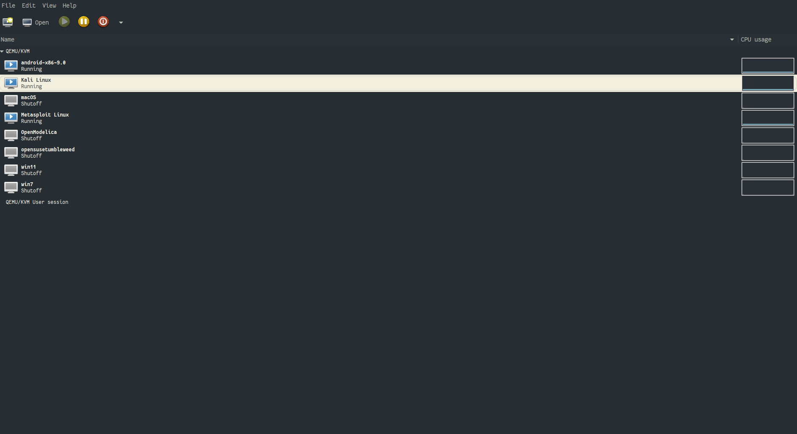
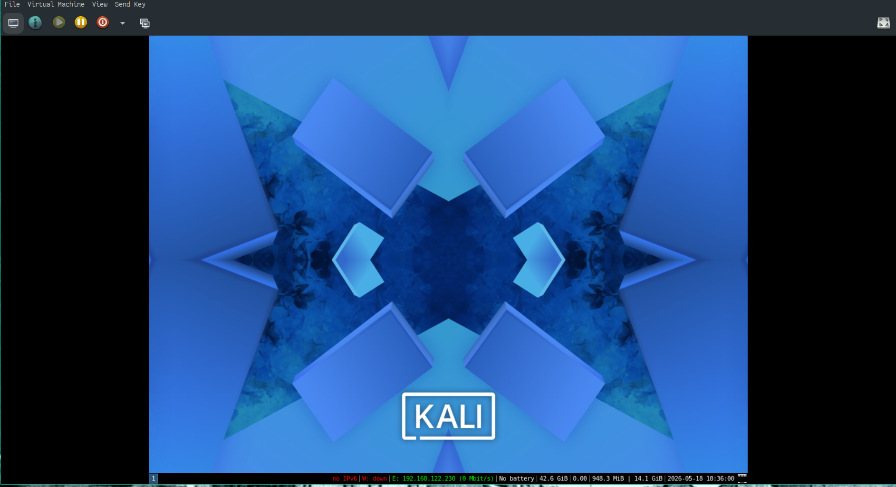
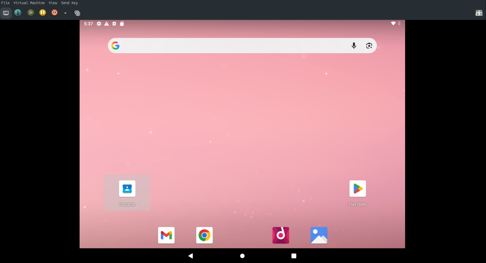
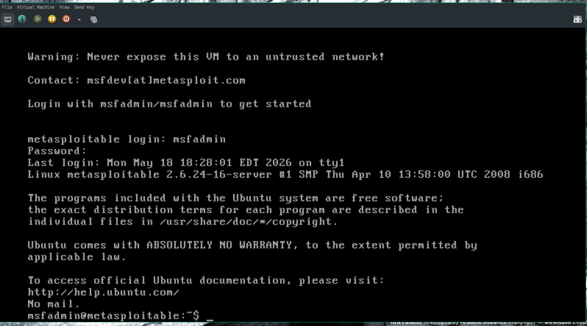
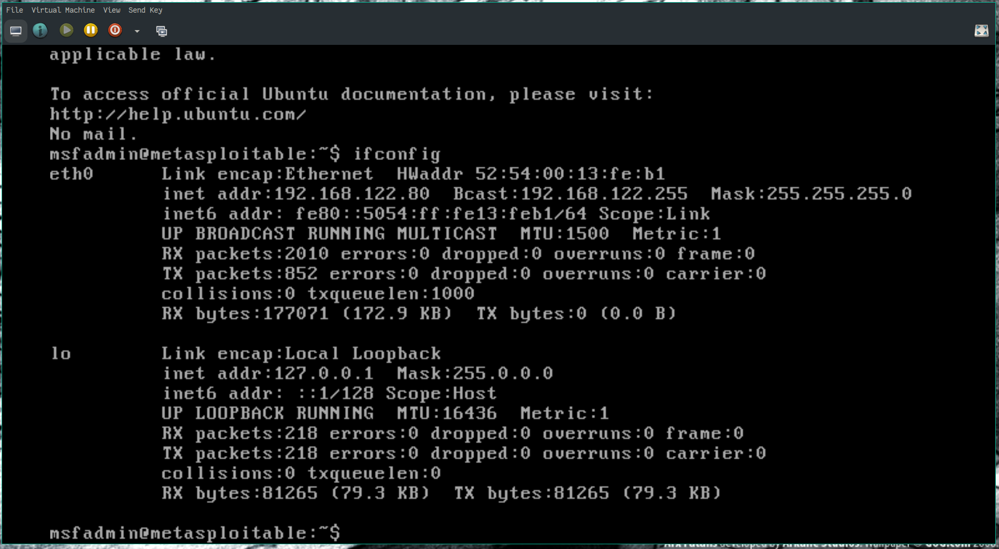
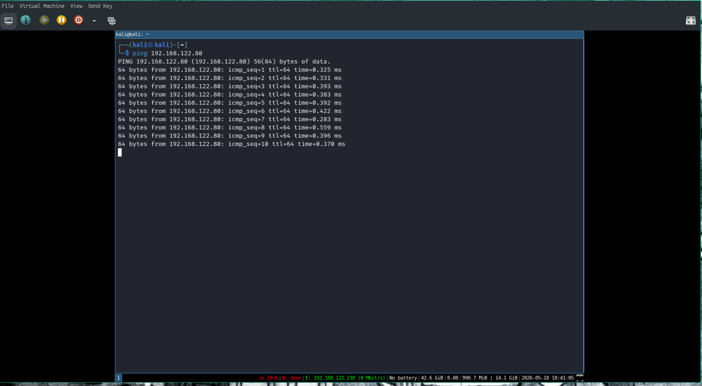

# Pen Lab Setup

## Technology Stack

Host OS: Gentoo Linux
Hypervisor: QEMU (using the virt-manager GUI, and some custom virsh commands)

### Kali Linux

Downloaded the qemu disk image, installed into qemu

### Android

Downloaded the Android installation disk image, installed into qemu using the Android installer.

### Metasploitable

Downloaded the zip file. Converted the Virtual-Box disk image into a qemu disk image, loaded into qemu.

## Architectural Diagram


## Screenshot of manager



## Screenshot of Kali Linux



## Screenshot of Android Running



## Screenshot of Metasploitable2 Running



## Kali Pinging Metasploitable 2 images





## Difficulties Encountered

- Rapid 7 did not have a qemu image, so had to convert the virtual box image to qemu. Was no aware the operating system used was a 32 bit system, and had to adjust the settings on my virtual machine for this.

- The Kali Linux image is very out of date. After setting up virsh to use the disk image, I had to update Kali:

``` shell
sudo apt update
sudo apt upgrade
```

There were more than 200 packages out of date (including the Kernel whick still had the recently found vulnerabilities `Copy Fail`, `Dirty Frag`, and `Fragnesia`)

Nessus would not install until Kali was updated.

- Android installation was painless, just had to tell it to create a partition, and install.

## Some Caveats

I have been using this virtual machine manager for years now, so I already had networking, clipboard sharing etc setup for the system. 

I had to make sure that Metasploitable2 is not accessable to the outside world.
